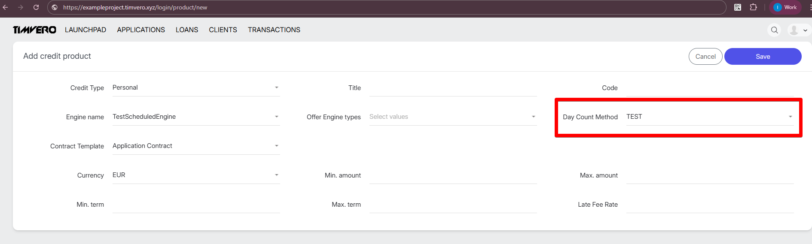

# How to Implement a Day Count Method

## What is a Day Count Method?

A Day Count Method is a way of counting days between two dates for financial calculations (interest, bond yields, etc.).

**Why do we need this?** Different financial instruments and markets use different conventions for calculating time. For example:
- One method treats all months as having 30 days
- Another uses the actual number of calendar days
- This affects the accuracy of interest calculations!

---

## Step-by-Step Guide: Creating Your Own Day Count Method

### Prerequisites

Before you begin, make sure you understand:
- How your financial method works (the calculation formula)
- What rules apply to dates (e.g., how to handle the 31st day of the month)
- What year basis the calculation uses (360, 365, 366, or actual)

---

## Step 1: Understand the Interface

All day count methods implement the `DayCountMethod` interface:

```java
public interface DayCountMethod {
    BigFraction fractionOfYear(LocalDate from, LocalDate to, PaymentGrid grid);
    long countDays(LocalDate from, LocalDate to, PaymentGrid grid);
}
```

### What does each method do?

| Method | What | Why | Returns |
|--------|------|-----|---------|
| `countDays()` | Counts days using your formula | Base day calculation | `long` - number of days |
| `fractionOfYear()` | Converts days to fraction of year | For interest calculations | `BigFraction` - exact fraction |

### Parameters explanation:

- **`from`** - start date (inclusive)
- **`to`** - end date (exclusive)
- **`grid`** - payment schedule (not needed by all methods, but parameter is required)

---

## Step 2: Create Your Class

Create a new class in the `com.timvero.scheduled.day_count` package:

```java
package com.timvero.scheduled.day_count;

import java.time.LocalDate;
import org.apache.commons.math3.fraction.BigFraction;
import org.springframework.stereotype.Component;

@Component(Method_YourName.NAME)  // ← needed for Spring (automatic registration)
public class Method_YourName implements DayCountMethod {

    public static final String NAME = "YOUR_METHOD";  // ← unique name for your method

    // Methods go here
}
```

### Naming Convention:

- **Class name**: `Method_` + method name (e.g., `Method_30E_360`)
- **NAME constant**: Method name for Spring and configuration (e.g., `"30E_360"`)

---

## Step 3: Implement `countDays()` Method

This is the main method — here you write the day counting logic.

### Example: Method 30E/360

Let's break down a real example — the **30E/360** method:

```java
@Override
public long countDays(LocalDate from, LocalDate to, PaymentGrid grid) {
    // STEP 1: Extract date components (year, month, day)
    int y1 = from.getYear();        // start year
    int y2 = to.getYear();          // end year
    int m1 = from.getMonthValue();  // start month (1-12)
    int m2 = to.getMonthValue();    // end month (1-12)
    int d1 = from.getDayOfMonth();  // start day
    int d2 = to.getDayOfMonth();    // end day

    // STEP 2: Apply method rules
    // 30E/360 rule: if day = 31, treat it as 30
    if (d1 == 31) {
        d1 = 30;  // adjust start day
    }
    if (d2 == 31) {
        d2 = 30;  // adjust end day
    }

    // STEP 3: Calculate using formula
    // 30E/360 formula: (Y2-Y1)×360 + (M2-M1)×30 + (D2-D1)
    return (y2 - y1) * 360    // year difference × 360 days
         + (m2 - m1) * 30     // month difference × 30 days
         + (d2 - d1);         // day difference
}
```

### Breaking Down the Formula:

**Why 360?** In the 30/360 method, a year always = 360 days (12 months × 30 days)

**Example calculation:**
- From: 2024-01-15 → (y1=2024, m1=1, d1=15)
- To: 2024-03-31 → (y2=2024, m2=3, d2=31→30)
- Result: (0 × 360) + (2 × 30) + (30 - 15) = **75 days**

---

## Step 4: Implement `fractionOfYear()` Method

This method converts days to a fraction of a year for interest calculations.

```java
@Override
public BigFraction fractionOfYear(LocalDate from, LocalDate to, PaymentGrid grid) {
    // Use our countDays() method and divide by year basis
    return new BigFraction(countDays(from, to, grid), 360L);
    //                     ↑                          ↑
    //                  numerator                 denominator
}
```

### What's the denominator?

| Method Type | Denominator | Why |
|-------------|-------------|-----|
| 30/360 family | 360 | Year = 12 months × 30 days |
| ACT/360 | 360 | Actual days, but year = 360 |
| ACT/365F | 365 | Actual days, year = 365 (fixed) |
| ACT/ACT | varies | Depends on actual year |

### Why `BigFraction`?

✅ Preserves precision (no rounding)
✅ Perfect for financial calculations
✅ Can be converted to `BigDecimal` or `double` later

---

## Step 5: Add Spring Component Annotation

```java
@Component(Method_30E_360.NAME)  // ← registers bean with name "30E_360"
public class Method_30E_360 implements DayCountMethod {
    public static final String NAME = "30E_360";  // ← this name is used in Spring
```

### Why do we need this?

1. **Automatic registration** — Spring will find and register your class automatically
2. **Dependency Injection** — you can get the method by name
3. **Runtime selection** — you can select the method dynamically from configuration

### How to use it later:

```java
@Autowired
@Qualifier("30E_360")  // ← use the NAME constant
private DayCountMethod dayCountMethod;
```

---

## Step 6: Add Internationalization (i18n)

Add a human-readable name for the UI in the `common_messages_en.properties` file:

**Location:** `web/src/main/resources/common_messages_en.properties`

```properties
#------------------------------- DayCountMethod --------------------------------------
day.count.method.30E_360=30E/360
day.count.method.YOUR_METHOD=Your Method Display Name
```

### Pattern:

```
day.count.method.{NAME}={Display Name}
```

Where:
- `{NAME}` — this is your `NAME` constant from the class
- `{Display Name}` — how it will be displayed to the user

### Example from the system:

```properties
day.count.method.30_360_BB=30/360 Bond Basis
day.count.method.ACT_360=Actual/360
day.count.method.ACT_ACT_ISDA=Actual/Actual ISDA
day.count.method.NL_365=No Leap/365 No Leap
```

---

## Step 7: Verify Your Implementation in UI

After implementing your Day Count Method, you can verify it appears in the Credit Product creation interface.

### Where to Find It

Navigate to the Credit Product creation page in your application:
```
https://your-domain.com/product/new
```

### What to Look For

Your newly created Day Count Method should now appear in the "Day Count Method" dropdown selector, displaying the localized name you defined in the `common_messages_en.properties` file.

**Screenshot:**




*The screenshot above shows the Day Count Method dropdown in the Credit Product creation form. Your method will appear alongside existing options like "30E/360", "Actual/360", etc.*

---

## Complete Example: Method_30E_360

Here's the complete, annotated implementation:

```java
package com.timvero.scheduled.day_count;

import java.time.LocalDate;
import org.apache.commons.math3.fraction.BigFraction;
import org.springframework.stereotype.Component;

/**
 * Implementation of the 30E/360 day count convention.
 *
 * This is a financial calculation method also known as "Eurobond Basis" or "30/360 ICMA".
 * It assumes all months have exactly 30 days and a year has 360 days.
 *
 * Key characteristics:
 * - Treats all months as having 30 days
 * - Year is assumed to have 360 days (12 months × 30 days)
 * - The 31st day of any month is adjusted to the 30th
 * - Commonly used in European bond markets
 */
@Component(Method_30E_360.NAME)
public class Method_30E_360 implements DayCountMethod {
    public static final String NAME = "30E_360";

    /**
     * Calculates the fraction of a year between two dates.
     *
     * @param from The start date (inclusive)
     * @param to The end date (exclusive)
     * @param grid The payment schedule grid (not used in this convention)
     * @return A fraction representing the time period as a portion of a 360-day year
     */
    @Override
    public BigFraction fractionOfYear(LocalDate from, LocalDate to, PaymentGrid grid) {
        // Calculate the number of days using 30E/360 convention, then divide by 360
        return new BigFraction(countDays(from, to, grid), 360L);
    }

    /**
     * Counts the number of days between two dates using the 30E/360 convention.
     *
     * Formula: (Y2 - Y1) × 360 + (M2 - M1) × 30 + (D2 - D1)
     *
     * @param from The start date (inclusive)
     * @param to The end date (exclusive)
     * @param grid The payment schedule grid (not used in this convention)
     * @return The number of days according to the 30E/360 convention
     */
    @Override
    public long countDays(LocalDate from, LocalDate to, PaymentGrid grid) {
        // Extract year, month, and day components from both dates
        int y1 = from.getYear();
        int y2 = to.getYear();
        int m1 = from.getMonthValue();
        int m2 = to.getMonthValue();
        int d1 = from.getDayOfMonth();
        int d2 = to.getDayOfMonth();

        // Apply the 30E/360 rule: if a day is the 31st, treat it as the 30th
        // This is done for BOTH start and end dates (unlike some other 30/360 variants)
        if (d1 == 31) {
            d1 = 30;
        }
        if (d2 == 31) {
            d2 = 30;
        }

        // Calculate using the 30E/360 formula
        // Each year contributes 360 days, each month contributes 30 days
        return (y2 - y1) * 360 + (m2 - m1) * 30 + (d2 - d1);
    }
}
```

---

## Checklist: Before You Submit

- [ ] Class created in the correct package: `com.timvero.scheduled.day_count`
- [ ] Implemented the `DayCountMethod` interface
- [ ] Added `@Component` annotation with correct NAME
- [ ] Implemented `countDays()` method with your logic
- [ ] Implemented `fractionOfYear()` method with correct denominator
- [ ] Added i18n entry in `common_messages_en.properties`
- [ ] Tested edge cases (31st day, leap year, etc.)

---

## Common Pitfalls

### ❌ Mistake 1: Wrong denominator

```java
// WRONG - using 365 instead of 360 for 30/360 method
return new BigFraction(countDays(from, to, grid), 365L);

// CORRECT
return new BigFraction(countDays(from, to, grid), 360L);
```

### ❌ Mistake 2: Not handling the 31st day

```java
// WRONG - 31st day is not handled
int d1 = from.getDayOfMonth();
int d2 = to.getDayOfMonth();
return (y2 - y1) * 360 + (m2 - m1) * 30 + (d2 - d1);

// CORRECT - applying the method's rule
if (d1 == 31) d1 = 30;
if (d2 == 31) d2 = 30;
```

### ❌ Mistake 3: Forgetting Spring annotation

```java
// WRONG - Spring won't register the bean
public class Method_30E_360 implements DayCountMethod {

// CORRECT
@Component(Method_30E_360.NAME)
public class Method_30E_360 implements DayCountMethod {
```

---

## Where to Find More Information

- **Existing implementations**: `src/main/java/com/timvero/scheduled/day_count/`
- **Interface definition**: `DayCountMethod.java`
- **Unit tests**: `src/test/java/com/timvero/scheduled/day_count/DayCountMethodTest.java`
- **i18n file**: `web/src/main/resources/common_messages_en.properties`

---

## Need Help?

If you're stuck:
1. Look at other implementations in the same package (they all have similar structure)
2. Check the unit tests to see examples of usage
3. Review the `PaymentGrid` class if your method needs to use the payment schedule

---

*Good luck with your implementation! 🚀*

*Last Updated: 2026-02-11*