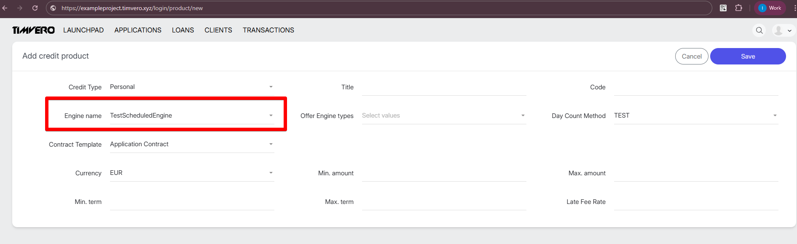

# How to Implement a Scheduled Engine

A Scheduled Engine generates a payment schedule for a loan — list of `PaymentSegment` records with dates, amounts, and remaining balances.

## Interface

```java
public interface ScheduledEngine<C extends CreditCondition> {
    Class<C> getConditionClass();
    List<PaymentSegment> payments(C condition, LocalDate interestStart,
        LocalDate paymentStart, MonetaryAmount principal, MonetaryAmount interest);
}
```

- `condition` — your entity with loan terms (rate, term, period, etc.)
- `interestStart` — when interest begins accruing
- `paymentStart` — first payment date
- `principal` / `interest` — current outstanding balances

The engine returns `List<PaymentSegment>`. Each segment is a JPA entity (`credit_expected_payment` table) with:

```java
new PaymentSegment(date, principalPayment, interestPayment, remainingPrincipal, remainingInterest)
```

## CreditCondition

Your condition class is a JPA entity that holds the loan terms. It must implement `CreditCondition`:

```java
public interface CreditCondition {
    MonetaryAmount getPrincipal();
    String getScheduleEngineName();
}
```

`getScheduleEngineName()` must return your engine's `NAME` constant — this is how the system resolves which engine to use.

Beyond the interface, add whatever fields your engine needs: rate, term, period, regular payment amount, etc.

## How the Engine Gets DayCountMethod

The `DayCountMethod` is configured on the Credit Product, not on the condition. To access it, inject all available methods and resolve by name:

```java
@Autowired
protected Map<String, DayCountMethod> dayCountMethods;

// Inside payments():
DayCountMethod dcm = dayCountMethods.get(
    condition.getSecuredOffer().getOriginalOffer().getCreditProduct().getDayCountMethod()
);
```

Then create `PaymentGrid` and `DayCounter` for interest calculation:

```java
LocalDate maturityDate = interestStart.plus(period.multipliedBy(term));
PaymentGrid grid = new PaymentGrid(maturityDate, interestStart.getDayOfMonth(), period);
DayCounter dayCounter = new DayCounter(grid, dcm);

// For each period:
BigFraction fraction = dayCounter.count(from, to);
MonetaryAmount accrued = calcRangeAccural(principal, annualRate, fraction);
```

## Implementation

**Annotation:** `@Service(NAME)` — registers the engine as a Spring bean.

### Example: Simple Equal Payment Engine

```java
@Service(SimpleScheduledEngine.NAME)
public class SimpleScheduledEngine implements ScheduledEngine<ExampleCreditCondition> {

    public static final String NAME = "SimpleScheduledEngine";

    @Autowired
    protected Map<String, DayCountMethod> dayCountMethods;

    @Override
    public Class<ExampleCreditCondition> getConditionClass() {
        return ExampleCreditCondition.class;
    }

    @Override
    public List<PaymentSegment> payments(ExampleCreditCondition condition, LocalDate interestStart,
            LocalDate paymentStart, MonetaryAmount principal, MonetaryAmount interest) {

        DayCountMethod dcm = dayCountMethods
            .get(condition.getSecuredOffer().getOriginalOffer().getCreditProduct().getDayCountMethod());

        Period period = condition.getPeriod();
        int term = condition.getTerm();
        BigDecimal rate = condition.getInterestRate();
        MonetaryAmount regularPayment = condition.getRegularPayment();

        LocalDate maturityDate = interestStart.plus(period.multipliedBy(term));
        PaymentGrid grid = new PaymentGrid(maturityDate, interestStart.getDayOfMonth(), period);
        DayCounter dayCounter = new DayCounter(grid, dcm);

        List<PaymentSegment> payments = new ArrayList<>();
        LocalDate from = interestStart;

        for (int i = 1; i <= term; i++) {
            LocalDate to = interestStart.plus(period.multipliedBy(i));

            // accrue interest for period
            if (from.isBefore(to)) {
                BigFraction fraction = dayCounter.count(from, to);
                interest = interest.add(calcRangeAccural(principal, rate, fraction));
            }

            // distribute payment: interest first, then principal
            MonetaryAmount interestPmt, principalPmt;
            if (i < term) {
                interestPmt = Lang.min(regularPayment, interest);
                principalPmt = Lang.min(principal, regularPayment.subtract(interestPmt));
            } else {
                interestPmt = interest;
                principalPmt = principal;
            }

            principal = principal.subtract(principalPmt);
            interest = interest.subtract(interestPmt);

            payments.add(new PaymentSegment(to, principalPmt, interestPmt, principal, interest));
            from = Lang.max(to, from);

            if (principal.isNegativeOrZero()) break;
        }

        return payments;
    }
}
```

The general pattern: iterate over periods, accrue interest per period using `DayCounter`, distribute each payment between interest and principal, build `PaymentSegment` list.

## i18n

Add a display name in `web/src/main/resources/common_messages_en.properties`:

```properties
scheduled.engine.{NAME}={Display Name}
```

## Verification

After implementation, your engine appears in the Engine Name dropdown on the Credit Product creation page (`/product/new`):


